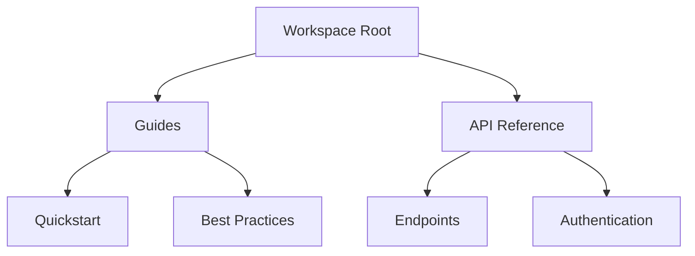

## Overview

TWG provides powerful tools to organize, collaborate on, and maintain your project documentation. You can structure content hierarchically, work with teams in real time, track changes, search efficiently, and apply professional templates. These features streamline your workflow from initial setup to ongoing updates.

<Columns cols={3}>
  <Card title="Document Hierarchy" icon="folder" href="#document-hierarchy">
    Organize content into nested folders and pages for intuitive navigation.
  </Card>
  <Card title="Real-time Collaboration" icon="users" href="#real-time-collaboration">
    Edit documents simultaneously with your team.
  </Card>
  <Card title="Version History" icon="git-branch" href="#version-history">
    Review and restore previous versions easily.
  </Card>
  <Card title="Search and Filtering" icon="search" href="#search-filtering">
    Find content quickly with advanced search tools.
  </Card>
  <Card title="Templates" icon="file-text" href="#templates-formatting">
    Start with pre-built templates and rich formatting.
  </Card>
</Columns>

## Document Hierarchy and Folders

Create a clear structure for your documentation using nested folders. You define a root workspace, add subfolders for categories like guides or APIs, and nest pages within them. This mirrors your project's architecture.



<Callout kind="tip">
  Use descriptive folder names and limit nesting to three levels for optimal navigation.
</Callout>

## Real-time Collaboration

Invite team members to co-edit documents live. Changes appear instantly, with cursors showing who is editing what. Resolve conflicts automatically or discuss via integrated comments.

<Tabs>
  <Tab title="Invite Collaborators" icon="user-plus">
    Share a document link or add emails directly. Set permissions: view, edit, or admin.
  </Tab>
  <Tab title="Live Editing" icon="edit-3">
    See real-time updates and use `@mentions` for notifications.
  </Tab>
</Tabs>

## Version History

Every edit creates a new version. You access the full history, compare changes, and revert if needed. Branching allows experimental edits without affecting the main document.

<Steps>
  <Step title="View History" icon="clock">
    Click the history icon in the toolbar to open the version panel.
  </Step>
  <Step title="Compare Versions" icon="git-compare">
    Select two versions to see a side-by-side diff.
  </Step>
  <Step title="Restore Version" icon="refresh-cw">
    Choose a version and click restore to apply it.
  </Step>
</Steps>

## Search and Filtering

Search across all documents with full-text indexing. Filter by tags, authors, or dates. Advanced operators like `tag:api` or `author:john` refine results.

| Filter Type | Example Query | Result |
|-------------|---------------|--------|
| Tags       | `tag:feature` | Pages tagged "feature" |
| Authors    | `author:alice`| Content by Alice |
| Date Range | `date:>2024-01-01` | Recent updates |

## Templates and Formatting

Start new pages from templates like API docs or changelogs. Rich formatting includes headings, code blocks, tables, and embeds.

<CodeGroup tabs="Markdown,Rich Text">
  ```markdown
  ## Heading

  - List item
  - Another item

  `Inline code`
  ```

  ```html
  <h2>Heading</h2>
  <ul>
    <li>List item</li>
    <li>Another item</li>
  </ul>
  <code>Inline code</code>
  ```
</CodeGroup>

<Expandable title="Advanced Formatting Options" default-open="false">
  Embed images, videos, or custom components. Use `{variable}` syntax for dynamic content in templates.

  ```javascript
  const config = {
    theme: 'dark',
    features: ['collaboration', 'search']
  };
  ```
</Expandable>

<Callout kind="success">
  Explore templates in the dashboard to accelerate your setup.
</Callout>