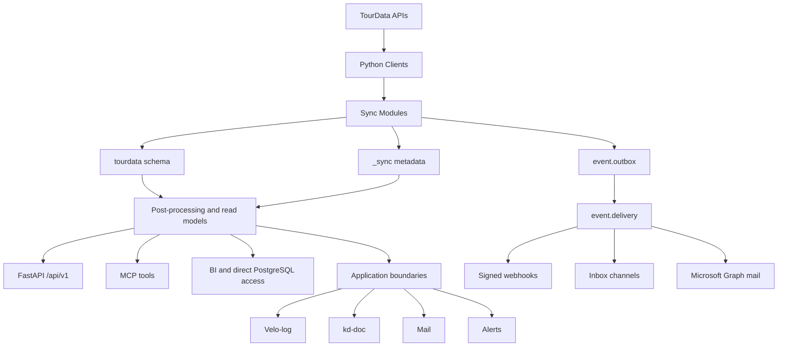
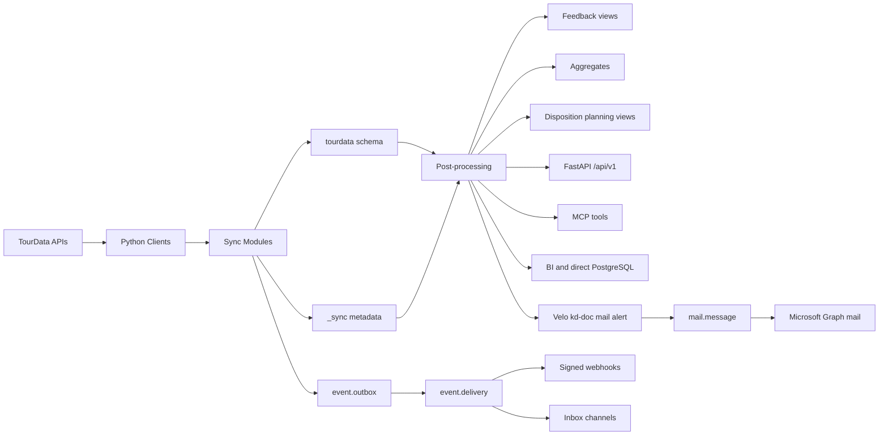

## Architektur-Übersicht

Der TourData Mirror synchronisiert TourData-Stamm- und Buchungsdaten nach Azure PostgreSQL und stellt sie über eine geschützte FastAPI-Anwendung, MCP-Tools und direkte BI-Zugriffe bereit. Die FastAPI-Anwendung liegt unter `src/tourdata_mirror/api/main.py`, bindet alle Fachrouter unter `/api/v1` ein und stellt die Health-Endpunkte `/health` und `/ready` bereit.

`/health` dient als Liveness-Prüfung. `/ready` prüft die Datenbankverbindung mit `SELECT 1`. In Produktionsumgebungen validiert die Anwendung Entra-JWTs und startet fail-closed, wenn die erforderliche Entra-Konfiguration fehlt. CORS ist auf die konfigurierten Browser- und SPA-Ursprünge beschränkt.

Die Autorisierung ist nach Routergruppen organisiert. Zu den Caller-Policy-Gruppen gehören `catalog`, `operations`, `feedback`, `aggregates` und `platform`. Dadurch können Anwendungen je nach Domäne unterschiedliche Zugriffsrechte erhalten, ohne dass jeder Router eigene Autorisierungsregeln implementieren muss.

Die Synchronisation und die Request-Verarbeitung sind getrennte Laufzeitpfade. Hintergrundjobs lesen die externen APIs und aktualisieren die lokale Datenbasis, während FastAPI, MCP und BI auf der lokalen PostgreSQL-Repräsentation arbeiten.

## Schema-Grenzen

Die Datenbank trennt Quelldaten, lokale Betriebsdaten, Synchronisationsmetadaten und abgeleitete Lesemodelle. Diese Trennung verhindert, dass ein erneuter Import lokale Entscheidungen oder Anwendungszustände überschreibt.

| Kategorie | Schemas oder Objekte | Verantwortung |
| --- | --- | --- |
| Source-owned Mirror | `tourdata` | Von TourData abgeleitete Daten. Die Ingestion darf Datensätze ersetzen oder aktualisieren. Planungs- und anwendungseigener Zustand gehört nicht in dieses Schema. |
| Application-owned operational | `dispo`, `velo_log`, `kd_store`, `mail`, `alert`, `event`, `workspace` | Lokale Betriebsdaten, Planungsentscheidungen, Dokumente, Notizen, Mail- und Alert-Historie sowie Event-Zustände. Diese Daten werden nicht durch die Ingestion überschrieben. |
| Synchronisationsmetadaten | `_sync` | Cursor, Synchronisationsläufe, Stream-Liveness und Mutation- beziehungsweise Hash-Informationen. |
| Read models | Materialized Views, Aggregate, Feedback-Views, Disposition-Planning-Views | Für API, BI, Assistenten und operative Auswertungen optimierte Lesemodelle. |

<Callout kind="info">

TourData-eigene Spiegeldaten können aktualisiert oder vollständig ersetzt werden. Lokale operative Entscheidungen, Dokumentänderungen, Velo-Log-Zustände, Alert-Historie, Mail-Protokolle und Event-Zustellungen bleiben dagegen in getrennten Schemas und werden durch die Ingestion nicht überschrieben.

</Callout>

Die wichtigste Grenze liegt zwischen `tourdata.dispo_*` und dem Schema `dispo`: `tourdata.dispo_*` enthält die austauschbare Rohspiegelung der Disposition-API. `dispo` enthält die lokale Planungswahrheit mit Anforderungen, Vorschlägen, Zuordnungen und Entscheidungsprotokollen.

## TourData-Clients

Die Clients kapseln Anmeldung, Tokenverwaltung, Wiederholungen und API-spezifische Requests. Jeder Client meldet sich per Bearer-Token an und unterstützt Retry- und Re-Login-Verhalten sowie HTTP-Transport-Re­tries.

| Client | Zuständigkeit und wichtige Endpunkte |
| --- | --- |
| `WebTripClient` | Tourkatalog und Tourdetails über `/trips` und `/trip/{code}`. |
| `DossierClient` | Buchungen über `/Dossier/search` sowie Umfragen über `/Survey`. |
| `DispositionClient` | Dispositionssuche und -details über `/v2/disposition/search` und `/v2/disposition/{id}`. |
| `AddressClient` | Reisepersonal und vollständige Kundenadressen über `/Reisepersonal` und `/Addresses/full`. |

Web Trip und Dossier sind getrennte externe APIs und verwenden getrennte Zugangsdaten. Die Zuordnung von Zugangsdaten und Mandanten erfolgt pro Tenant. Ein Fehler oder abgelaufener Token eines Tenants darf die Verarbeitung anderer Tenants nicht beeinträchtigen.

## Sync-Module

Die Synchronisationslogik liegt unter `src/tourdata_mirror/sync/`. Die Module arbeiten tenantbezogen und verwenden je nach Quelle Cursor, Zeitfenster oder Hashes.

| Modul | Verantwortung |
| --- | --- |
| `trips.py` | Synchronisiert den Web-Trip-Katalog und die Tourdetails. |
| `trips_soon.py` | Aktualisiert in kurzen Intervallen bevorstehende und aktive Touren. |
| `bookings.py` | Synchronisiert Buchungen und Dossier-Daten. |
| `customers.py` | Synchronisiert Kunden-, Adress- und Clubdaten. |
| `surveys.py` | Importiert Feedback- und Umfragedaten aus Dossier. |
| `dispositions.py` | Importiert Rohdaten aus der Disposition-API. |
| `dispo_trips.py` | Verknüpft geplante Touren mit Dispositionen. |
| `dispo_staff.py` | Synchronisiert Personal- und Dispositionszuordnungen. |
| `persons.py` | Synchronisiert Personen- und Reisepersonalbezüge. |
| `reisepersonal.py` | Importiert Personalinformationen aus der Address-API. |
| `changes.py` | Erkennt Mutationen über Hashes und erzeugt bei echten Änderungen Events. |
| `state.py` | Führt Cursor, Runs, Status, Zähler und weitere Synchronisationsmetadaten. |

Alle Pfade folgen grundsätzlich dem Muster: lesen, kanonisieren und hashen, nur bei einer Mutation schreiben. Backfills können die Event-Erzeugung unterdrücken, um Event-Stürme bei historischen Importen zu vermeiden.

## Mutation-Klassifizierung

`sync/changes.py` klassifiziert jeden gelesenen Datensatz anhand seines bisherigen Zustands und seines kanonischen Payload-Hashes. Dadurch lassen sich echte Änderungen von wiederholten, unveränderten API-Antworten unterscheiden.

| Status | Bedeutung |
| --- | --- |
| `NEW` | Erstmals erkannter Datensatz. |
| `BASELINE` | Erste Schreibung oder Wechsel der Hash-Version. Der Datensatz erhält eine Vergleichsbasis, gilt aber nicht als fachliche Änderung für die Event-Erzeugung. |
| `CHANGED` | Der kanonische Payload hat sich gegenüber dem gespeicherten Hash geändert. |
| `UNCHANGED` | Der Payload ist identisch. Es erfolgt keine fachliche Schreibaktion. |

Nur `NEW` und `CHANGED` können Events erzeugen. `BASELINE` und `UNCHANGED` erzeugen keine Events. Bei Backfills kann die Event-Erzeugung unabhängig von der Klassifizierung unterdrückt werden.

Die Mutation und der zugehörige `event.outbox`-Eintrag werden in derselben Datenbanktransaktion geschrieben. Ein Rollback entfernt damit sowohl die fachliche Änderung als auch das Event.

## Azure Container Apps Jobs

Azure Container Apps Jobs bilden die primäre Scheduling-Infrastruktur für wiederkehrende und getrennte Verarbeitungspfade. Jeder Job besitzt eine eigene Ausführungsgrenze, damit Fehler in einem Bereich nicht automatisch andere Pipelines stoppen.

| Job | Aufgabe | Schedule oder Trigger |
| --- | --- | --- |
| `feedback_ingest` | Inkrementeller Dossier-Umfrageimport, Sentiment- und Themenanalyse sowie Aktualisierung der Materialized Views. | Zeitgesteuert, inkrementell |
| `trips_backfill` | Vollständiger beziehungsweise umfangreicher Web-Trip-Katalog-Backfill. | Wöchentlich |
| `trips_soon` | Aktualisiert bevorstehende und aktive Touren. | Ungefähr alle 30 Minuten |
| `ingest_imb` | Umfrageimport, Analyse und Aktualisierung der Views für Imbach. | Tenant-spezifisch, zeitgesteuert |
| `ingest_rmt` | Umfrageimport, Analyse, View-Aktualisierung und aus Umfragen abgeleitete Touren für RMT. | Tenant-spezifisch, zeitgesteuert |
| `ingest_exc` | Optionale Umfrage- und Tourenverarbeitung für Excellence. | Optional, zeitgesteuert |
| `ingest_voe` | Umfrageimport, Analyse, View-Aktualisierung und aus Umfragen abgeleitete Touren für VOE. | Tenant-spezifisch, zeitgesteuert |
| `dispo` | Importiert Reisepersonal und anschließend Dispositionen aus einem rollierenden Zeitfenster. | Zeitgesteuert |
| `bookings` | Führt einen nächtlichen, mandantenübergreifenden Dossier-Deltasynchronisationslauf aus. | Nächtlich |
| `customers` | Synchronisiert Kundenadressen und Clubdaten nach der Buchungssynchronisation. | Nachgelagert zu `bookings` |
| `analyze` | Führt eine manuelle Sentiment- und Themenanalyse aus. | Manuell |
| `migrate` | Führt Datenbankmigrationen aus. | Manuell |
| `mail_deliver` | Verarbeitet Mail-Retries und Retention, evaluiert Alerts und übernimmt Event-Fan-out sowie Zustellung. | Zeitgesteuert |

Die Container-Apps-Umgebung verwendet externes HTTPS-Ingress für die API, Azure Container Registry, eine User-assigned Managed Identity, Azure Key Vault, Log Analytics und Application Insights. Die Jobs laufen in Consumption-Workload-Profilen.

`mail_deliver` enthält derzeit auch den Event-Zustellungsworker. Die Event-Zustellung ist daher logisch getrennt, aber noch kein eigener Service.

## Azure Function

Die Azure Function `functions/nightly_sync/__init__.py` läuft timer-gesteuert täglich ungefähr um 02:00 UTC. Sie liest die konfigurierten Tenants aus `TOURDATA_TENANTS`, löst die jeweiligen Web-Trip- und Dossier-Zugangsdaten auf und verwendet dieselben Synchronisationsmodule wie die übrigen Betriebswege.

Die Verarbeitung ist pro Tenant isoliert:

- Die Trip- und Buchungssynchronisation laufen unabhängig voneinander.
- Ein fehlerhafter Tenant stoppt die Verarbeitung der übrigen Tenants nicht.
- Fehlen Zugangsdaten für eine Verarbeitung, wird der betroffene Pfad übersprungen.
- Die Function schlägt insgesamt nur fehl, wenn kein Tenant eine Buchungssynchronisation erfolgreich abschließen konnte.

Die Function läuft als Azure Linux Function mit Python 3.12, VNet-Integration, Managed Identity, Key Vault-Referenzen, Application Insights und privater Datenbankverbindung.

## Admin-Interfaces

Die FastAPI-Anwendung stellt zusätzlich statische administrative und diagnostische Oberflächen bereit.

| Endpoint | Zweck |
| --- | --- |
| `/admin` | Administrative Oberfläche für Betriebs- und Verwaltungsfunktionen. |
| `/debug` | Diagnose- und Debugging-Oberfläche. |
| `/schema-viewer` | Anzeige von Schema- und Kataloginformationen. |
| `/ai-admin` | Verwaltung und Prüfung der AI-Konfiguration. |
| `/mail-admin` | Verwaltung und Diagnose des Mail-Systems. |
| `/alerts-admin` | Verwaltung und Prüfung von Alert-Regeln und Auslösungen. |

Diese Oberflächen ergänzen die API. Sie ersetzen weder die Authentifizierung noch die Caller-Policies der geschützten API-Routen.

## Datenfluss

Die vollständige Verarbeitungskette beginnt bei den externen TourData-APIs und endet bei API-, BI-, MCP- und Zustellungsintegrationen.

Die Clients übernehmen Bearer-Login, Token-Erneuerung und Transport-Re­tries. Die Sync-Module verarbeiten die Daten tenantbezogen und schreiben die Quelldaten in `tourdata`, den Lauf- und Cursorzustand in `_sync` sowie echte Mutationen in `event.outbox`.

Nachgelagerte Verarbeitung aktualisiert Feedback-Views, Materialized Views, Aggregate und Dispositions-Planungsmodelle. FastAPI und MCP lesen diese lokalen Modelle. BI-Systeme können die API oder, für dafür vorgesehene Anwendungsfälle, PostgreSQL direkt verwenden.

Events werden vom Zustellungsworker über `event.delivery` an abonnierte Endpunkte verteilt. Je nach Endpoint entstehen signierte Webhooks, Inbox-Einträge oder Mail-Nachrichten über Microsoft Graph.

## Komponenten

| Bereich | Ort | Verantwortung |
| --- | --- | --- |
| API-Anwendung | `src/tourdata_mirror/api/` | FastAPI-Anwendung, Authentifizierung, Router, Pagination und Rate Limits |
| TourData-Integration | `src/tourdata_mirror/tourdata_client.py` | HTTP-Authentifizierung, Retries, Pagination und Upstream-API-Aufrufe |
| Synchronisation | `src/tourdata_mirror/sync/` | Upserts, Cursorverarbeitung, Mutationserkennung und inkrementelle Ingestion |
| Datenbank | `src/tourdata_mirror/db.py` | Connection Pool und einzelne Datenbankverbindungen |
| Konfiguration | `src/tourdata_mirror/config.py` | Umgebungsvariablen, Tenant-Zugangsdaten und Feature-Schalter |
| Feedback-Verarbeitung | `feedback_enrichment.py`, `feedback_sentiment.py` | LLM-basierte Sentimentanalyse, Themen und Empfehlungen |
| Alerts | `src/tourdata_mirror/alerts/` | Metriken, Regeln, Regelpakete, Auswertung und UI-Unterstützung |
| Mail | `src/tourdata_mirror/mail/` | Queue, Templates, Transport und Zustellung |
| Events | `src/tourdata_mirror/events/` | Event-Formate, Signierung, Inbox- und Outbox-Persistenz sowie Zustellung |
| MCP | `src/tourdata_mirror/mcp/` | Lokale und entfernte LLM-Integration |
| CLI | `src/tourdata_mirror/cli/` | Backfills, Migrationen, Ingestion, Exporte, Analysen und Betriebsaufgaben |
| Infrastruktur | `infra/terraform/`, `Dockerfile`, `.github/workflows/` | Azure-Bereitstellung und CI/CD |
| Schema | `db/migrations/`, `docs/schema/mirror-schema.sql` | Datenbankschema und Migrationen |

<Callout kind="info">

Die Datenbank ist die lokale Integrations- und Persistenzschicht, nicht die öffentliche Anwendungsgrenze. Externe Anwendungen wie Velo-Log und kd-doc greifen über `/api/v1` auf ihre Daten zu und verbinden sich nicht direkt mit der privaten PostgreSQL-Datenbank. Dadurch bleiben Authentifizierung, Caller-Policies, Pagination und Domänenregeln zentral in FastAPI.

</Callout>

Die Trennung erlaubt es, Synchronisation unabhängig vom Leseverkehr auszuführen. Gleichzeitig können die API und die Read Models abgeleitete Daten wie Feedback-Aggregate, Buchungsansichten, Dispositionen, Alerts und Planungsinformationen bereitstellen.

## Tenants

Die konfigurierte Tenant-Landschaft umfasst typischerweise:

- `twr`
- `imb`
- `rmt`
- `voe`
- `exc`

Jeder Tenant besitzt eine eigene Zuordnung zu TourData-Mandant, Login-Werten und Zugangsdaten. Web Trip und Dossier verwenden dabei getrennte Credentials. Die Synchronisationsjobs verarbeiten Tenants unabhängig voneinander, damit ein Fehler in einem Tenant weder die Daten anderer Tenants überschreibt noch deren Verarbeitung verhindert.