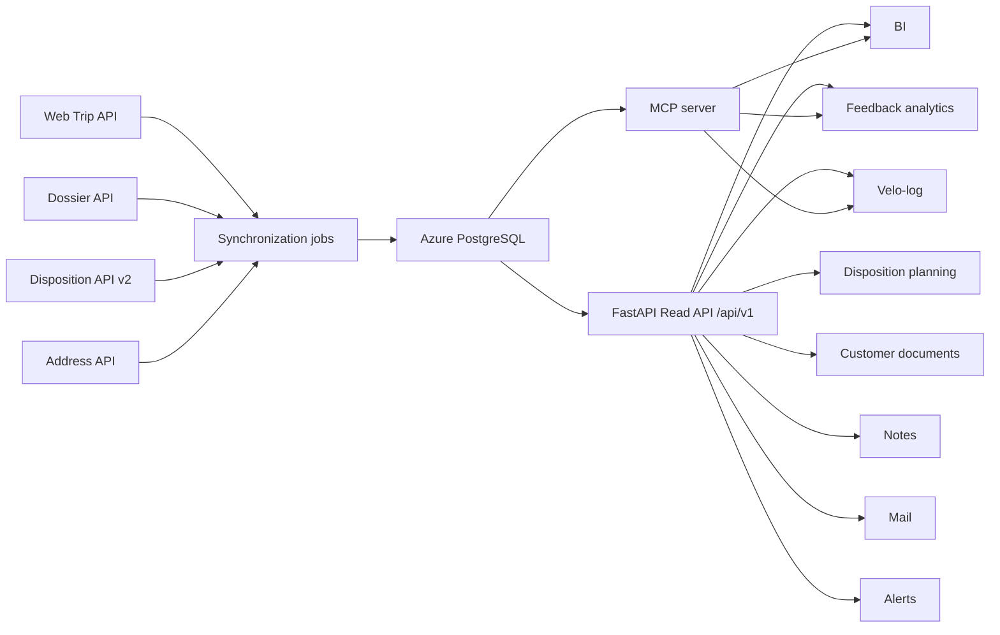

## TourData Mirror

The TourData Mirror service copies master and operational data from TourData into Azure PostgreSQL and exposes it through an authenticated Read API with Entra SSO. It provides nightly incremental sync, a local queryable data layer for BI direcanbindung, and an MCP server for LLM clients.

## Key Components

| Component | Source Path | Description |
|---|---|---|
| API application | `src/tourdata_mirror/api/` | FastAPI app, authentication, routers, pagination, and rate limits |
| TourData integration | `tourdata_client.py` | HTTP authentication, retries, pagination, and upstream API calls |
| Synchronization | `sync/` | Upsert and incremental ingestion logic |
| Database | `db.py` | PostgreSQL connection pool |
| Configuration | `config.py` | Environment settings, tenant credentials, and feature switches |
| Feedback processing | `feedback_enrichment.py`, `feedback_sentiment.py` | LLM sentiment analysis, themes, and recommendations |
| Alerts | `alerts/` | Metrics, rules, packs, evaluation, and UI support |
| Mail | `mail/` | Queue, templates, transport, and delivery |
| Events | `events/` | Event formats, signing, inbox and outbox persistence, and delivery |
| MCP | `mcp/` | Local and remote LLM integration |
| CLI | `cli/` | Backfills, migrations, ingestion, exports, analysis, and operations |
| Infrastructure | `infra/terraform/`, `Dockerfile`, `.github/workflows/` | Azure deployment and CI/CD |

## Funktionen

| Bereich | Beschreibung |
|---|---|
| Daten-Synchronisation | Initiale Backfills und nächtliche inkrementelle Syncs über Web Trip API, Dossier API, Disposition API v2 und Address API — pro-Tenant, mit Cursor-Tracking und Upserts in PostgreSQL. |
| Read API | FastAPI unter `/api/v1` mit Entra SSO, Keyset-Pagination, Read-Only-Transaktionen und Feature-Flags für kontrollierte Schreiboperationen. |
| MCP Server | LLM-Integration via stdio (`tdm-mcp`) und Streamable HTTP (`tdm-mcp-http`) für Claude und Remote-Clients. Überwiegend lesend, mit kontrollierten Schreiboperationen für Notes, Mail und Alert-Regeln. |
| Feedback-Analytics | LLM-gestützte Sentiment-Analyse, Theme-Extraktion, NPS, Bewertungen, Trip-Empfehlungen und Pipeline-Status-Monitoring. |
| Aggregate Analytics | Dashboard- und BI-Schnittstelle mit Measures, Dimensionen, Zeitraum-Filtern, Mindestgrössen-Unterdrückung und Rate-Limits. |
| Dispositions-Planung | Planning-Runs, Zuweisungsvorschläge, Anforderungen, Personalverwaltung und Self-Service-Portal mit Links und Abwesenheiten. |
| Velo Log | Trip- und Abfahrt-Anwendungsstatus: Bearbeitungsstatus, Anhänger, Ersatz-Fahrräder, Druckzyklen und Teilnehmer-Snapshots. |
| Kundendokumente (kd-doc) | Content-Addressed-Storage für JSON-Dokumente und Assets, mit öffentlichen signierten Customer-Links (ohne Entra). |
| Alerts | Metriken, Regeln, Trigger, Packs, Inbox, Webhook- und Mail-Kanäle, Dry-Run und Preview. |
| Mail | Asynchrone, idempotente Warteschlange mit Templates, Tenant-Layouts, Retries und Sender-Autorisierung. |
| Events | Event-Katalog, CloudEvents-Formatierung, HMAC-Signierung, Inbox/Outbox und Webhook-Zustellung. |
| Schema-Introspektion | Live-Katalog-Metadaten, DDL-Generierung und Allowlist-basierte Tabellen-Samples direkt aus PostgreSQL. |
| AI-Konfiguration | Model-Katalog (OpenRouter), Task-Settings für Sentiment, Empfehlungen, Assistent und KD-Dok-Generierung mit Versionshistorie. |
| CLI-Tools | Backfills, Ingestion, Enrichment, Migrations, Exports, Alert-/Mail-/Event-Operationen und Schema-Exploration. |

## API Übersicht

Alle Daten-Endpoints liegen unter `/api/v1` und erfordern Entra JWT-Authentifizierung. Ausnahmen: Health-Probes und öffentliche kd-doc-Links.

| Domain | Methoden | Endpunkte | Zugriff |
|---|---|---|---|
| Health | GET | `/health`, `/ready` | Ohne Auth |
| Trips | GET | 5 Endpoints: Liste, Abfahrten, Detail, Realization, Similar | Entra |
| Bookings | GET | 7 Endpoints: Liste, Detail, Graph, Hotels, Stats, Manifest, Crew | Entra |
| Persons & Customers | GET | 3 Endpoints: Person, Customer, Customer-Bookings | Entra |
| Business Partners | GET | 2 Endpoints: Partner-Detail, Partner-Trips | Entra |
| Reference Data | GET | 2 Endpoints: Katalog, Collection | Entra |
| Feedback | GET, POST | ~19 Endpoints: Surveys, NPS, Sentiments, Themes, Empfehlungen, Query | Entra |
| Aggregates | GET, POST | 3 Endpoints: Katalog, Query, Values | Entra |
| Dispositions | GET | 1 Endpoint: Departure | Entra |
| Dispo | GET, POST, PUT, PATCH, DELETE | ~25 Endpoints: Runs, Proposals, Decisions, Requirements, Staff, Portal | Entra (Writes feature-flagged) |
| Velo | GET, PUT, POST, DELETE | 7 Endpoints: Status, AppData, Status/Meta-Updates, Anhänger, Prints | Entra (Writes feature-flagged) |
| KD-Doc (auth) | GET, PUT, POST, DELETE | 9 Endpoints: Store, Assets, Links, Published | Entra (Writes feature-flagged) |
| KD-Doc (public) | GET | 3 Endpoints: Token, Aktuell, Asset | Signiertes Token |
| Notes | GET, POST, PATCH, DELETE | 4 Endpoints: CRUD | Entra |
| Events | GET | 1 Endpoint: Katalog | Entra |
| Mail | GET, POST, PUT | 9 Endpoints: Messages, Senders, Templates, Admin | Entra (Writes feature-flagged) |
| Alerts | GET, POST, PATCH, PUT, DELETE | ~25 Endpoints: Metrics, Rules, Channels, Inbox | Entra (Writes feature-flagged) |
| Sync-Status | GET, POST | 3 Endpoints: Status, Stats, Refresh-Bookings | Entra |
| Schema | GET | 3 Endpoints: Katalog, DDL, Sample | Entra |
| AI | GET, POST, PUT, DELETE | 8 Endpoints: Models, Settings, Registry | Entra |
| Admin UIs | GET | 6 Routes: Admin, Debug, Schema-Viewer, AI-Admin, Mail-Admin, Alerts-Admin | Policy-abhängig |

Eine detaillierte Auflistung aller Endpoints findet sich auf der Seite [API Endpunkte](/tourdata-mirror/api-endpoints).

<Callout kind="tip">

The mirror provides a stable, local, authenticated representation of TourData. Applications use the FastAPI endpoints rather than connecting directly to the database.

</Callout>